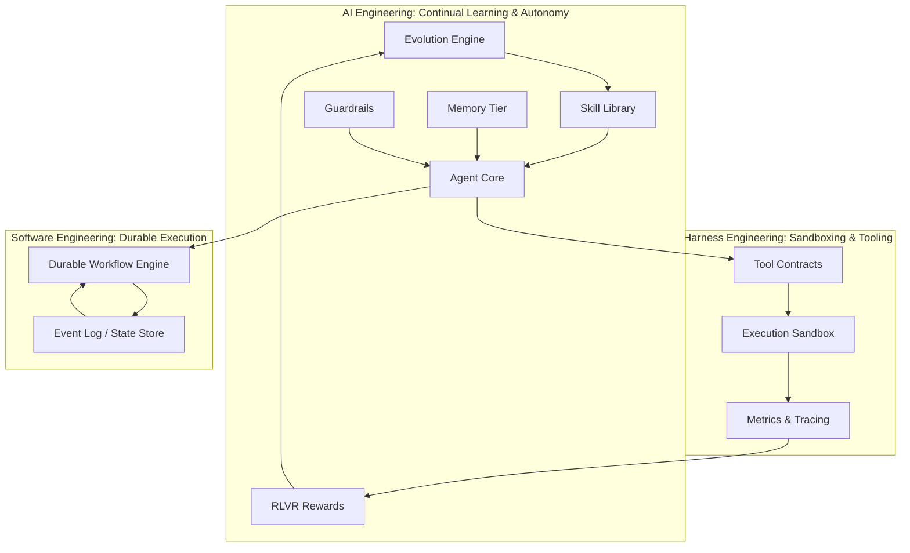
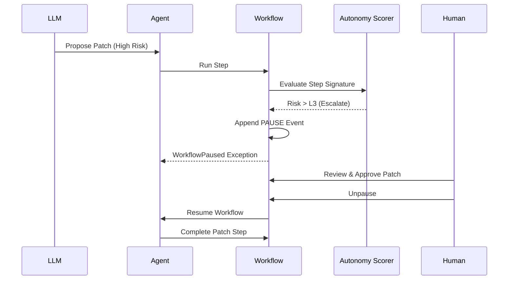

# DuraAgent: Self-Evolving Agentic Architecture 🧬

DuraAgent is a production-grade, state-driven agentic framework built for robust execution, granular observability, and continuous self-evolution. It marries the reliability of **Durable Execution** with the adaptive potential of **Reinforcement Learning with Verifiable Rewards (RLVR)**.

[](https://github.com/duraagent/duraagent/actions)
[](https://www.python.org/downloads/)

## System Architecture

DuraAgent is built upon three foundational engineering pillars: Software Engineering, Harness Engineering, and AI Engineering.



## The Layers of Autonomy

### Layer 1: Event-Sourced State Store + Durable Workflow Engine
- **Event-Sourced (`events.py`, `state_store.py`)**: All agent actions are modeled as immutable events appended to a SQLite log. State is dynamically reconstructed via materialized views.
- **Idempotency (`workflow.py`)**: Workflows use execution signatures (MD5) and determinism contexts to resume cleanly after crashes without duplicating side effects.

### Layer 2: Execution Harness & Contracts
- **Strict I/O (`contracts.py`)**: Uses Pydantic to strictly define inputs and outputs for all agentic tools.
- **Sandboxing (`harness.py`)**: Safe subprocess execution environments with configurable timeouts and syntax validation.

### Layer 3: The Cognitive Loop
- **Memory Systems (`memory.py`)**: Implements a four-tier taxonomy: Working (buffer), Procedural (skills), Episodic (event logs), and Semantic (vector RAG).
- **Agent Loop (`agent.py`)**: Analyze → Generate Patch → Verify → Correct. Failures are fed back into the context natively.

### Layer 4: Deep Observability
- **Tracing & Guardrails (`tracing.py`, `guardrails.py`)**: OpenTelemetry-style span tracking, combined with AST-level safety constraints.
- **Metrics (`metrics.py`, `inspector.py`)**: Telemetry extractors for durations, retry rates, token counts, and step trajectories. 

### Layer 5: Reinforcement Learning with Verifiable Rewards (RLVR)
- **Objective Feedback (`rewards.py`)**: Computes scalar and multi-signal rewards from objective test outcomes rather than subjective LLM evaluators. 
- **Evolution (`skills.py`)**: Instructions are stored with Pydantic configurations and EMA (Exponential Moving Average) decay, evolving continuously based on reward history.

### Layer 6: Durable Autonomy (L0-L4)
- **Governance (`autonomy.py`)**: An `AutonomyLevel` matrix and `HeuristicScorer` measure *Uncertainty* (diff sizes) and *Novelty* (file targets). 
- **Escalation**: High-risk actions automatically pause the workflow, allowing asynchronous human review before resuming identically where it left off.



## Getting Started

DuraAgent uses `uv` for lightning-fast package management and `pytest` for running its extensive test suite.

```bash
# Setup
uv venv
source .venv/bin/activate
uv pip install -e .

# Run Tests
uv run pytest -v
```

### Demos

Run the demos sequentially to understand each architectural layer:
1. `uv run python demos/demo_durability.py`
2. `uv run python demos/demo_agent_loop.py`
3. `uv run python demos/demo_evolution.py`
4. `uv run python demos/demo_full.py`

### Running the Agent on a Project

To unleash DuraAgent on a codebase to automatically discover and patch bugs:
```bash
# Run on the included sample project
uv run python run_project.py ./sample_project

# Note: You must export ANTHROPIC_API_KEY to use the real Claude model
export ANTHROPIC_API_KEY="your-api-key"
uv run python run_project.py ./sample_project
```

Inspect any run dynamically:
```bash
uv run python duraagent/inspector.py
```


